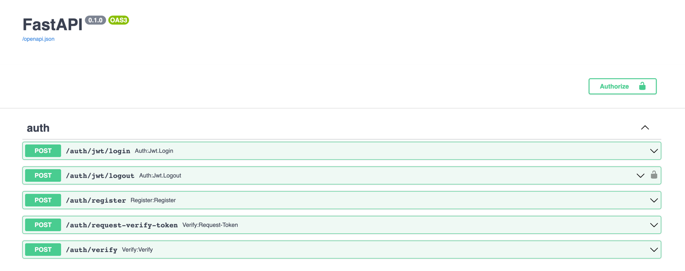
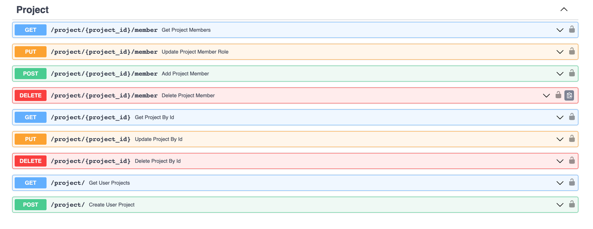
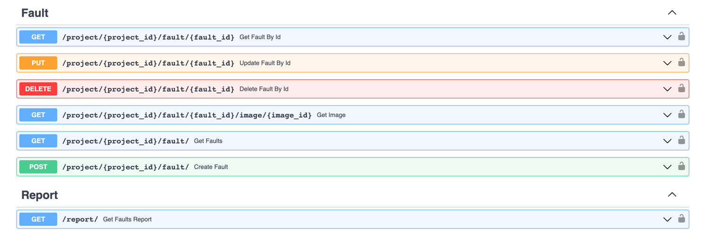

# FastAPI project

## General info

* Users can registration and authentication;

* Users can create a "project" and add other users to the project by specifying permissions for the new member: "editor" or "reader"

* Users can create project "faults"  (upload images and description) assigned to created project via HTTP request. The project creator can also remove members and change their permission access;
* Users can list, update and delete their "fault";
* Users can get report on email with all project "fault";
* Users can get "fault's" image;

## How to set up the project

* Create docker containers for the project by running $ docker compose build;
* Start the application by launching the containers $ docker compose up;

## Technologies
* Python
* FastAPI
* SQLAlchemy
* PostgreSQL
* alembic
* Pydantic
* Pytest
* redis
* Celery
* Flower